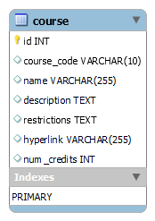

## Database Purpose

Store University of Saskatchewan courses, defining prerequisite and dependency relationships to corresponding sets of courses.

## Datapoints

### Relevant Links:

- University of Saskatchewan Course Catalogue (all courses): [https://catalogue.usask.ca/](https://catalogue.usask.ca/)

### Course

- Course code
  - e.g., CMPT 370
  - The structure consists of a of a two-four letter String, a space, and an integer code
    - Because of the initial String, this datapoint can be represented as a String
  - The decimal point and following numbers may be ignored (e.g., the ".3" in CMPT 370.3 can be ignored)
- Name
  - e.g., Intermediate Software Engineering
  - Can be represented as a String
- Description
  - e.g., Principles and techniques for developing software combined with the practical experience of creating a mid-size software system as a member of a software development team. Includes: teamwork; projects, planning and process; users and requirements; use cases; modeling; quality; software architecture; testing; GUI design, design principles, patterns and implementation; ethics; professionalism.
  - Can be represented as a String
- Prerequisite(s)
  - e.g., CMPT 280
  - Must be consistent with the Course Code datapoint
- Restriction(s)
  - e.g., Restricted to students in Applied Computing.
  - Can be represented as a String
- Hyperlink
  - e.g., [https://catalogue.usask.ca/CMPT-370](https://catalogue.usask.ca/CMPT-370)
  - Can be represented as a String
- Number of credits
  - e.g., 3
  - This can be derived from the original course code (e.g., the ".3" in CMPT 370.3 represents three credits)

## MySQL Tables

### Course Table

The first row is the fields and the second is an example record. Datatypes and incrementation is included for specificity.

| id : INT , AUTO_INCREMENT | course_code : VARCHAR(10) | name : VARCHAR(255)                 | description : TEXT    | prerequisites : INT                                                                                                                                                                                                                                                                                                                                                                                          | restrictions : TEXT                            | hyperlink : VARCHAR(255)            | num_credits : INT |
| ------------------------- | ------------------------- | ----------------------------------- | --------------------- | ------------------------------------------------------------------------------------------------------------------------------------------------------------------------------------------------------------------------------------------------------------------------------------------------------------------------------------------------------------------------------------------------------------ | ---------------------------------------------- | ----------------------------------- | ----------------- |
| 5                         | "CMPT 370"                | "Intermediate Software Engineering" | _needs to be defined_ | "Principles and techniques for developing software combined with the practical experience of creating a mid-size software system as a member of a software development team. Includes: teamwork; projects, planning and process; users and requirements; use cases; modeling; quality; software architecture; testing; GUI design, design principles, patterns and implementation; ethics; professionalism." | "Restricted to students in Applied Computing." | https://catalogue.usask.ca/CMPT-370 | 3                 |

